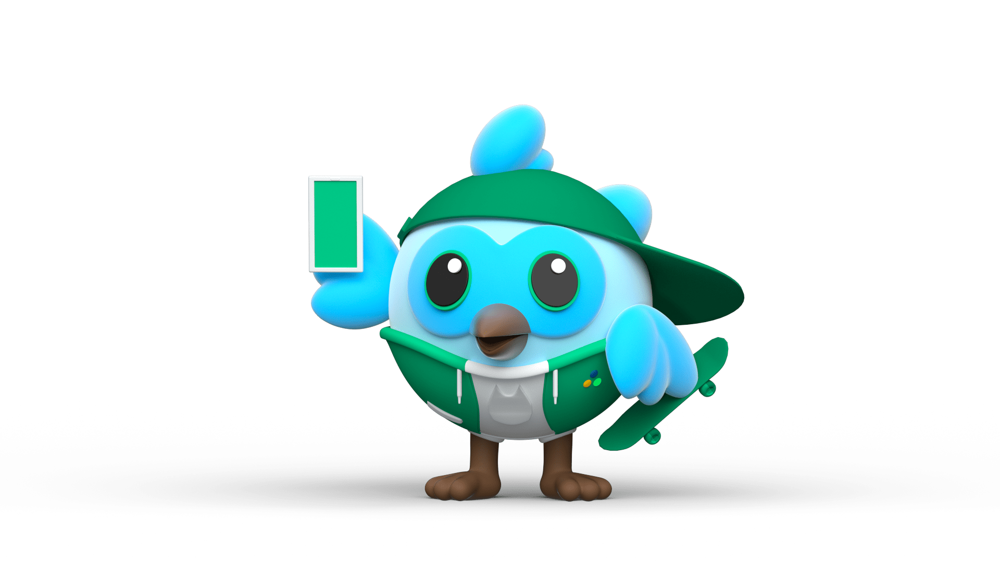

 
  Olá meu nome é Carlos Henrique, sou desenvolvedor <strong>Flutter</strong>.

  🦄 Conhecimentos: <strong>Dart, Flutter, CI/CD (fastlane, codemagic), Firebase, MongoDB, Firestore, consumo de API e criacao de metodos API (C#), 
Streams, GetX, Git and GitHub.</strong>

  🦄 Estudando: <strong>MobX, Hasura (GraphQL), Mixins, Integração Firebase Auth + Hasura, Testes Unitários e Testes de Widget..</strong>

  💌 Se você deseja realizar um projeto comigo (ou bater papo), não hesite em me enviar uma mensagem:: ⤵️

  
  

  
